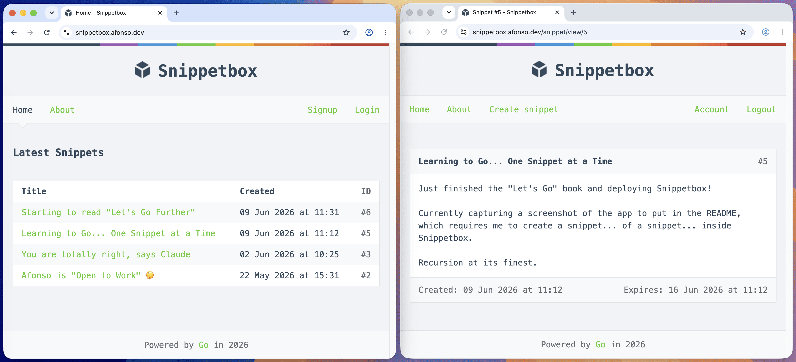

# Snippetbox

A full-stack web application for creating and sharing text snippets, built with Go using only the standard library — no frameworks.

**Live demo:** https://snippetbox.afonso.dev

Built section-by-section through [_Let's Go_ by Alex Edwards](https://lets-go.alexedwards.net/), then containerized and deployed to my own infrastructure.



## Tech Stack

- **Go** — HTTP server, routing, templating, and middleware via `net/http` and `html/template`
- **MySQL** — relational data storage with a hand-rolled database model
- **HTML/CSS** — server-rendered templates with a custom inheritance layout system
- **Docker · nginx · Cloudflare** — see [Deployment](#deployment)

## Features

- Create, view, and share snippets with expiry dates
- User accounts with signup, login, and session management
- CSRF protection and secure cookie handling
- Structured logging, panic recovery middleware, and centralized error handling

## Deployment

Runs in production as a Docker container on a VPS:

- Reverse-proxied through **nginx**
- **TLS** via Let's Encrypt at the origin, fronted by **Cloudflare**
- Local development uses self-signed certificates (per the book)

## Getting Started

Run locally:

```bash
git clone https://github.com/afonsodemori/snippetbox.git
cd snippetbox
go run ./cmd/web
```

## Licence

[MIT](LICENSE)
